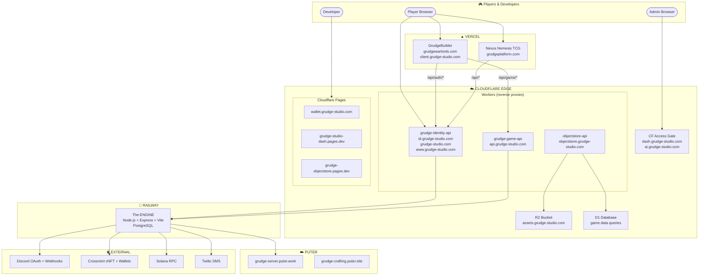
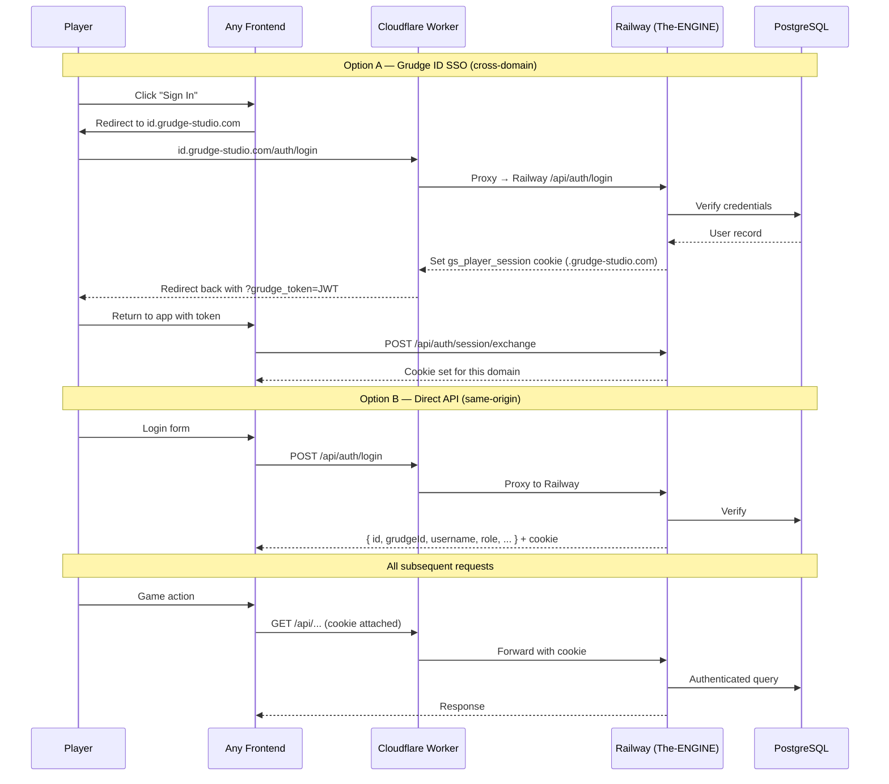
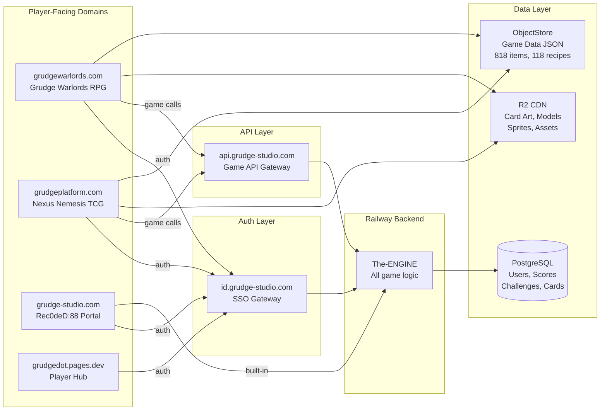

# Grudge Studio — Domain Directory & Flow Charts

> **Verified**: 2026-05-06 23:30 UTC — 19/19 services online
> **Owner**: Racalvin The Pirate King

---

## Infrastructure Topology



## Authentication Flow



## Game Routing



## Complete Domain Registry

### Production Domains (Player-Facing)

| # | Domain | Serves | Platform | Repo | Status |
|---|--------|--------|----------|------|--------|
| 1 | `grudge-studio.com` | Gaming portal + Rec0deD:88 (1360+ games) | CF Worker → Railway | The-ENGINE | ✅ |
| 2 | `id.grudge-studio.com` | Auth gateway — SSO for all Grudge apps | CF Worker → Railway | The-ENGINE | ✅ |
| 3 | `api.grudge-studio.com` | Game API gateway — leaderboards, chat, challenges | CF Worker → Railway | The-ENGINE | ✅ |
| 4 | `grudgewarlords.com` | Grudge Warlords — Dark Fantasy RPG | Vercel | Grudge-Builder | ✅ |
| 5 | `client.grudge-studio.com` | Alias for grudgewarlords.com | CNAME → Vercel | Grudge-Builder | ✅ |
| 6 | `grudgeplatform.com` | Nexus Nemesis — TCG with 100K cNFTs | Vercel | nexus-nemesis-game | ✅ |
| 7 | `wallet.grudge-studio.com` | Server-side Solana wallet UI | CF Pages | — | ✅ |

### Infrastructure Domains

| # | Domain | Serves | Platform | Status |
|---|--------|--------|----------|--------|
| 8 | `assets.grudge-studio.com` | R2 CDN — sprites, models, card art, audio | Cloudflare R2 | ✅ |
| 9 | `objectstore.grudge-studio.com` | Game data API — weapons, armor, materials (R2 + D1) | CF Worker | ✅ |
| 10 | `grudge-objectstore.pages.dev` | Static JSON API — 55+ endpoints, 818 items | CF Pages | ✅ |
| 11 | `ai.grudge-studio.com` | GRUDA Legion AI hub (behind CF Access) | CF Worker | 🔒 |
| 12 | `dash.grudge-studio.com` | Admin dashboard (behind CF Access) | CF Pages | 🔒 |

### Tool & Hub Domains

| # | Domain | Serves | Platform | Status |
|---|--------|--------|----------|--------|
| 13 | `grudgedot.pages.dev` | GrudgeDot — player gateway, identity hub, game launcher | CF Pages | ✅ |
| 14 | `grudge-studio-dash.pages.dev` | Admin dashboard prototype — service health, app catalog | CF Pages | ✅ |
| 15 | `grudgechain-vibe-ide.pages.dev` | Vibe IDE — AI code editor, cloud deploy | CF Pages | ✅ |
| 16 | `grudachain.grudgestudio.com` | GRUDA Legion nexus — status hub | Static | ✅ |

### Puter Cloud

| # | Domain | Serves | Platform | Status |
|---|--------|--------|----------|--------|
| 17 | `grudge-server.puter.work` | Puter Worker — AI chat, sprite gen, game sync | Puter | ✅ |
| 18 | `grudge-crafting.puter.site` | Warlord crafting & professions frontend | Puter | ✅ |

### Cloudflare Workers

| # | Worker Name | Routes | Backend | Source |
|---|-------------|--------|---------|--------|
| 19 | `grudge-identity-api` | `id.grudge-studio.com/*` `grudge-studio.com/*` `www.grudge-studio.com/*` | Railway | `deploy/auth-gateway/` |
| 20 | `grudge-game-api` | `api.grudge-studio.com/*` | Railway | `deploy/game-api-gateway/` |
| 21 | `objectstore-api` | `objectstore.grudge-studio.com/*` | R2 + D1 | ObjectStore repo |
| 22 | `grudge-ai-hub` | `ai.grudge-studio.com/*` | R2 + KV + Workers AI | grudge-ai-hub repo |

### Decommissioned / Dead

| Domain | Was | Why Dead |
|--------|-----|----------|
| `grudgeplatform.io` | Web3 hub on Vercel | Domain locked to different Vercel account |
| `account.grudge-studio.com` | Planned account service | DNS record never created |
| `edge.grudge-studio.com` | Badge-reader Worker | DNS record never created |
| `ale.grudge-studio.com` | AI gateway Worker | DNS record never created |
| `grudgedot-launcher.vercel.app` | GrudgeDot launcher | Stale Vercel deployment, 404 |
| VPS Docker + CF Tunnel | Old api.grudge-studio.com backend | Replaced by Railway + CF Worker |

## Game Catalog

### 🗡️ Grudge Warlords — Dark Fantasy RPG
- **URL**: grudgewarlords.com
- **Races**: Human, Orc, Elf, Dwarf, Barbarian, Undead
- **Classes**: Warrior, Mage, Ranger, Worge
- **Factions**: Crusade, Fabled, Legion
- **Professions**: Miner, Forester, Mystic, Chef, Engineer (Tier 1–8)
- **Systems**: Islands, building, harvesting, AI companions, crews, ships, tower defense
- **Economy**: Gold, GBUX (Solana cNFT)
- **Auth**: Grudge ID, Discord, Google, Phantom, Puter, Guest

### 🃏 Nexus Nemesis — Trading Card Game
- **URL**: grudgeplatform.com
- **Cards**: 102 Season 0 templates, 100,000 cNFT hard cap
- **Tribes**: Iron Will, Blood For Conquest, Fabled, Tribal War, Ethereal Signature
- **Rarity**: Common 50%, Rare 30%, Epic 15%, Legendary 4.5%, Mythic 0.5%
- **PvP**: Real-time via Colyseus, ELO ±32, custom table invites
- **PvE**: 6 AI captains, progressive difficulty decks
- **Packs**: Season 0 packs, reward packs (level-up), GBUX purchase
- **Economy**: GBuX (Solana SPL), GRUDA (Polygon ERC-20)
- **Wallets**: Server-side Crossmint (Solana + Polygon auto-created at registration)
- **Achievements**: 21 across 6 categories (battle, wins, streak, pvp, collection, tribal)

### 🕹️ Rec0deD:88 — Retro Gaming Portal
- **URL**: grudge-studio.com
- **Games**: 1,360+ titles across 9 platforms
- **Platforms**: NES, SNES, Genesis, N64, Neo Geo, PlayStation, Game Boy, GBA, NDS
- **Emulation**: EmulatorJS in-browser player
- **Leaderboards**: Per-game + global, personal best + world record tracking
- **Challenges**: 1v1 PvP with GBUX wager escrow + automatic payout
- **Tournaments**: Single-elimination brackets, GBUX entry fees + prize pools
- **Chat**: 4 rooms (General, Retro Gaming, Custom Engines, Trading Post)
- **Discord**: Auto-post scores, records, challenge results via webhooks

### ⚔️ Mage Arena — Multiplayer Combat
- **URL**: grudge-studio.com (WebSocket at /ws/arena)
- **Format**: Real-time hero arena, up to 4 players per room
- **Heroes**: Multiple mage types with unique abilities
- **Modes**: PvP, PvE, Solo
- **Network**: WebSocket rooms with host migration

### ⚒️ Warlord Crafting Suite
- **URL**: grudge-crafting.puter.site
- **Recipes**: 118 crafting recipes
- **Materials**: 93 material types
- **Items**: 818 items in ObjectStore

## DNS Quick Reference

### Cloudflare (grudge-studio.com zone)
```
A     @           → 192.0.2.1 (proxied, Worker intercepts)
A     api         → 192.0.2.1 (proxied, Worker intercepts)
A     id          → 192.0.2.1 (proxied, Worker intercepts)
A     www         → 192.0.2.1 (proxied, Worker intercepts)
A     assets      → R2 custom domain
A     objectstore → 192.0.2.1 (proxied, Worker intercepts)
A     wallet      → CF Pages
A     dash        → CF Pages + Access
A     ai          → CF Worker + Access
A     launcher    → 192.0.2.1 (planned, nothing deployed)
A     ws          → planned for WebSocket
CNAME client      → Vercel (cname.vercel-dns.com)
```

### Vercel (grudgenexus team)
```
grudgewarlords.com    → Grudge-Builder project
grudgeplatform.com    → nexus-nemesis-game project
grudge-studio.com     → (via CF Worker, not direct)
client.grudge-studio.com → Grudge-Builder project (CNAME)
```

### Puter
```
grudge-crafting.puter.site  → Crafting frontend
grudge-server.puter.work    → API worker (AI, sync, sprites)
grudgewarlords.puter.site   → Mirror (unmanaged)
grudgestudio.puter.site     → GRUDACHAIN (unmanaged)
grudge-studio.puter.site    → Cloud Dashboard (legacy)
grudge.puter.site           → Reserved (default page)
```
